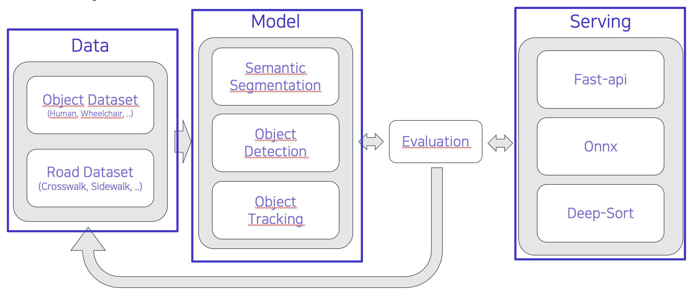
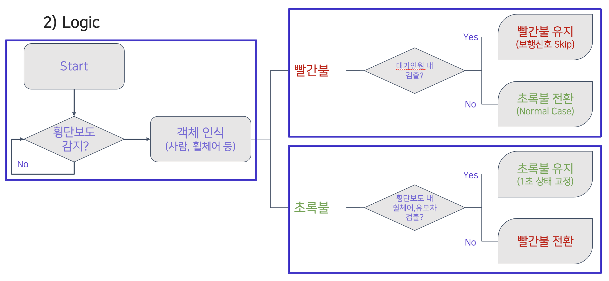
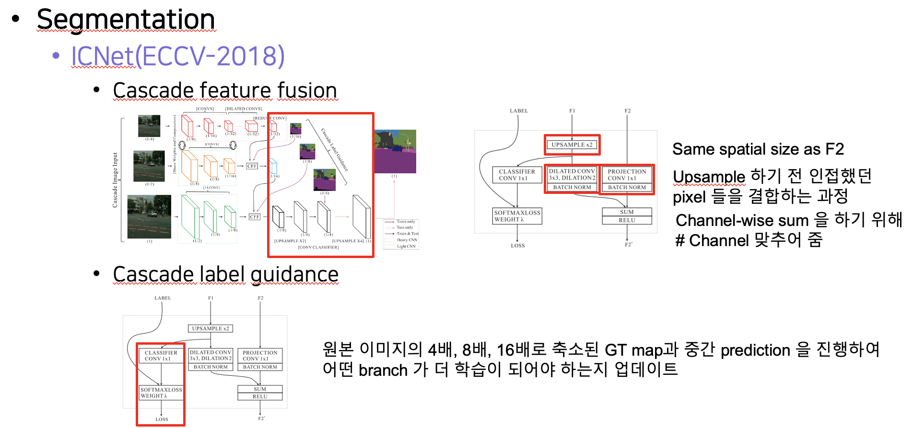
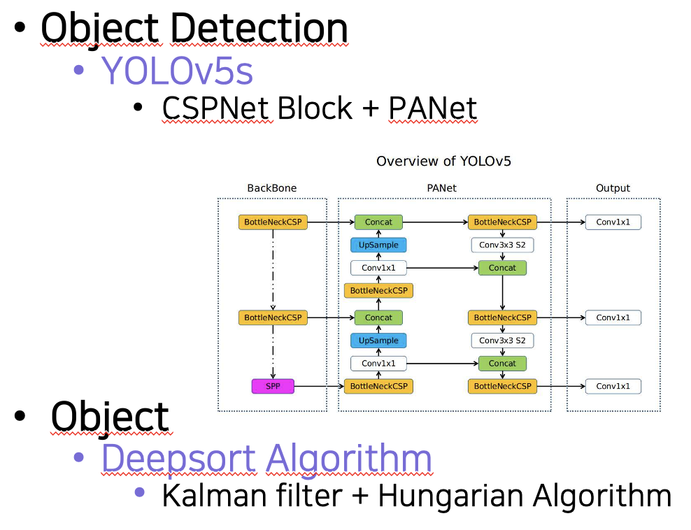

# 효율적인 신호체계를 위한 횡단보도 및 객체 탐지

# Table of Contents
- [Purpose](#Purpose)
- [Member](#Member)
- [Structure](#Structure)
    - [Project Flow](###ProjectFlow)
    - [Logic](###Logic)
    - [Model](###Model)
- [Install](#Install)
- [RunServer](#Run-Server)
- [Result](#Result)
- [Reference](#Reference)

# Purpose
거동이 불편하신 분들을 탐지하여 신호 연장 및 불필요한 신호(사람이 없는데 횡단보도 신호를 기다려야 하는 차량, 차량이 없는데 횡단보도의 신호가 바뀔 때 까지 기다려야 하는 보행자)를 줄이기 위한 모델 제작

# Member
|김준영|김현수|안소정|임성민|황주영|
| :---: | :---: | :---: | :---: | :---: |
| [](https://github.com/falling90) | [](https://github.com/hyuns1102) | [](https://github.com/ansojung) | [](https://github.com/mickeyshoes) | [](https://github.com/saberhark) | 
 | Data, Modeling | Data, Modeling, Frontend | Backend |Data, Modeling |Web Full-stack|


# Structure
### ProjectFlow

  

### Logic

  

### Model
- segmentation

  

- object detection + tracking

  

# Install
### 1. Set environment
- Choose One(conda, python venv)
#### Using conda
```shell
conda create -n venv python=3.7 -y
conda activate venv
conda install pytorch==1.7.0 torchvision cudatoolkit=10.1 -c pytorch
```

#### Using python venv
```shell
python3 -m venv virtualvenv
source virtualvenv/bin/activate
```

### 2. Install requirements
```shell
pip install -r requirements.txt
```

# Run Server
```shell
python serving/server.py
```

# Result

<!-- [](https://www.youtube.com/watch?v=7nSc8btsQPg) -->
[](https://www.youtube.com/watch?v=7nSc8btsQPg) <span> [이미지 링크] 부스트캠프 AI Tech 2기 네트워킹데이 p2p 시연영상(휠체어 감지) </span>

[](https://www.youtube.com/watch?v=M45dbMqYT1A) <span> [이미지 링크] 부스트캠프 AI Tech 2기 p2p 시연영상(사람x) </span>

<!-- [](https://www.youtube.com/watch?v=M45dbMqYT1A) -->


# Reference
[1] yolov5 - https://github.com/ultralytics/yolov5

[2] yolov5 + deepsort - https://github.com/mikel-brostrom/Yolov5_DeepSort_Pytorch

[3] mmsegmentation - https://github.com/open-mmlab/mmsegmentation

[4] ICNet - https://arxiv.org/abs/1704.08545

[5] 인도 보행 영상 - https://aihub.or.kr/aidata/136

[6] 차량/횡단보도 인지 영상(수도권) - https://aihub.or.kr/aidata/27675
